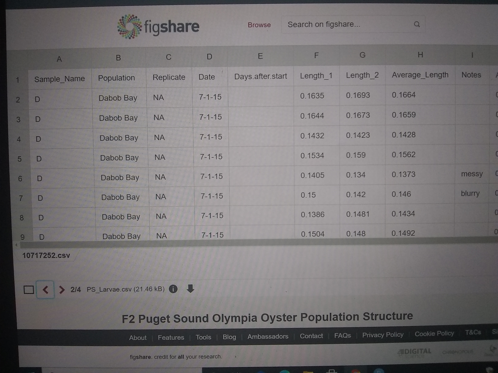

```{r, echo = FALSE, message = FALSE, warning = FALSE}
library(ggplot2)
library(dplyr)
library(tidyr)
library(stringr)
```


## The Experiment

The experiment data I'm using came from a paper called ["Consistent diferences in Fitness Traits across Multiple Generations of Olympia Oysters"](https://www.nature.com/articles/s41598-018-24455-3.pdf), listed as ["F2 Puget Sound Olympia Oyster Population Structure"](https://figshare.com/articles/dataset/F2_Puget_Sound_Olympia_Oyster_Population_Structure/5975452?file=10717249) on Figshare. It was created by Katherine Silliman, Tynan Bowyer, and Steven Roberts.

## The Data
This experiment explored the growth of populations of oysters taken from different locations all grown in the same lab environment.

There are three relevant data tables from the experiment

1. PS_larvae: includes lengths and areas for each oyster at three time points

2. oyster_tile_size: size data in relation to tile grown on

3. larval_counts: includes counts of population size and number of dead oysters at each time point for each population at each location

## PS_Larvae Data
This is the layout of the data table used for the following two scatterplots.
```{r, echo = FALSE}
PS_larvae <- read.csv("../raw_data/Copy of PS_Larvae.csv") 
```


## Average Shell Length over Time in 3 Populations

This scatterplot shows the average length of all the oysters for each of the three locations, Daobob Bay, Fidalgo Bay, and Oyster Bay.
```{r, message = FALSE, echo = FALSE}
popul_days <- group_by(PS_larvae, Population, Date)
#average length for each population
avg_l_popul <- summarize(popul_days, mean_l = mean(Average_Length), na.rm = TRUE)
#added column for days after start
avg_l_popul$Days = c(0, 14, 7, 0, 14, 7, 0, 14, 7)
#scatterplot of days passed vs length for each population with a line of best fit for each population
daysvslength <- ggplot(data = avg_l_popul, mapping = aes(x = Days, y = mean_l, group = Population)) +
  geom_point(aes(shape = Population, color = Population, size = 3)) +
  labs(x = "Days", y = "Average Shell Length (mm)") +
  scale_x_continuous(breaks = c (0, 7, 14)) +
  ggtitle("Shell Length over Time by Population")
print(daysvslength)
```


## Average Length for Each Population at Each Location

This scatterplot is built from the last one, instead showing the average length of oyster for each of the three populations at from each of the three sites.
```{r, message = FALSE, echo = FALSE}
popul_days <- group_by(PS_larvae, Population, Date)
#made location and site number columns to use for filtering and later scatterplots
popul_days_sep <- popul_days %>%
  separate(Replicate, into = c("location", "number"), sep = "_") 
#changed NA values in Days.after.start to 0
popul_days_sep$Days.after.start[is.na(popul_days$Days.after.start)] <- 0
#making individual data tables for each location
fidalgo_bay <- filter(popul_days_sep, str_detect(location, "NF"), na.rm = TRUE)
oyster_bay <- filter(popul_days_sep, str_detect(location, "SS"), na.rm = TRUE)
daobob_bay <- filter(popul_days_sep, str_detect(location, "HC"), na.rm = TRUE)

```


```{r, message = FALSE, echo = FALSE}
#3 scatterplots of days passed vs length for each population location with site-specific data
daysvslength_fidalgo <- ggplot(data = fidalgo_bay, mapping = aes(x = Days.after.start, y = Average_Length, group = number)) +
  geom_point(aes(size = 3, shape = number, color = number)) +
  scale_x_continuous(breaks = c (0, 7, 14)) +
  labs(x = "Days", y = "Average Shell Length (mm)") +
  ggtitle("Shell Length over Time by Site at Fidalgo Bay") 
daysvslength_oyster <- ggplot(data = oyster_bay, mapping = aes(x = Days.after.start, y = Average_Length, group = number)) +
  geom_point(aes(size = 3, shape = number, color = number)) +
  scale_x_continuous(breaks = c (0, 7, 14)) +
  labs(x = "Days", y = "Average Shell Length (mm)") +
  ggtitle("Shell Length over Time by Site at Oyster Bay") 
daysvslength_daobob <- ggplot(data = daobob_bay, mapping = aes(x = Days.after.start, y = Average_Length, group = number)) +
  geom_point(aes(size = 3, shape = number, color = number)) +
  scale_x_continuous(breaks = c (0, 7, 14)) +
  labs(x = "Days", y = "Average Shell Length (mm)") +
  ggtitle("Shell Length over Time by Site at Daobob Bay") 
print(daysvslength_fidalgo)
print(daysvslength_oyster)
print(daysvslength_daobob)
```


