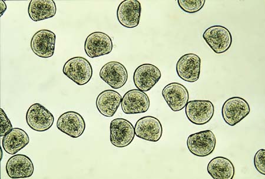

```{r, echo = FALSE, message = FALSE, warning = FALSE}
library(ggplot2)
library(dplyr)
library(tidyr)
library(stringr)
```


## The Experiment

The experiment data I'm using came from a paper called ["Consistent diferences in Fitness Traits across Multiple Generations of Olympia Oysters"](https://www.nature.com/articles/s41598-018-24455-3.pdf), listed as ["F2 Puget Sound Olympia Oyster Population Structure"](https://figshare.com/articles/dataset/F2_Puget_Sound_Olympia_Oyster_Population_Structure/5975452?file=10717249) on Figshare. It was created by Katherine Silliman, Tynan Bowyer, and Steven Roberts.

## The Data
This experiment explored the growth of populations of oysters taken from different locations all grown in the same lab/natural environment.

There are three relevant data tables from the experiment

1. PS_larvae: includes lengths and areas for each oyster at three time points

2. oyster_tile_size: includes size data in relation to tile grown on

3. larval_counts: includes counts of population size and number of dead oysters at each time point for each population at each location

## PS_Larvae Data

This is the layout of the data table used for the following  scatterplots. Measurements were taken at day 0, 7 and 14.
```{r, echo = FALSE}
PS_larvae <- read.csv("../raw_data/Copy of PS_Larvae.csv") 
```
{width=50%}

## Average Shell Length over Time in 3 Populations

```{r, message = FALSE, echo = FALSE}
popul_days <- group_by(PS_larvae, Population, Date)
```

I took the mean of the average length of each oyster for each population. That led to three data points over time for each population since they were measured every 7 days. To make the dates work correctly I created a string of the days after start for each mean.
```{r, message = FALSE}
#average length for each population
avg_l_popul <- summarize(popul_days, mean_l = mean(Average_Length), na.rm = TRUE)
#added column for days after start
avg_l_popul$Days = c(0, 14, 7, 0, 14, 7, 0, 14, 7)
```


```{r, message = FALSE, echo = FALSE}
#scatterplot of days passed vs length for each population with a line of best fit for each population
daysvslength <- ggplot(data = avg_l_popul, mapping = aes(x = Days, y = mean_l, group = Population)) +
  geom_point(aes(shape = Population, color = Population, size = 3)) +
  geom_line(aes(color=Population)) +  
  labs(x = "Days", y = "Average Shell Length (mm)") +
  scale_x_continuous(breaks = c (0, 7, 14)) +
  ggtitle("Shell Length over Time by Population")
print(daysvslength)
```

## Average Shell Area

This scatterplot shows the average length of all the oysters for each of the three locations, Daobob Bay, Fidalgo Bay, and Oyster Bay.

I created it the same way as the one for average length, just calculated the average area instead.

The shape of the larvae makes the area smaller than the largest length. But the overall trend is the same, so the oysters are a consistent shape across population, but they grow at different rates.

{width=30%}


```{r, message = FALSE, echo = FALSE}
#average area for each population
avg_a_popul <- summarize(popul_days, mean_a = mean(Area), na.rm = TRUE)
#added column for days after start
avg_a_popul$Days = c(0, 14, 7, 0, 14, 7, 0, 14, 7)
#scatterplot of days passed vs length for each population with a line of best fit for each population
daysvslength <- ggplot(data = avg_a_popul, mapping = aes(x = Days, y = mean_a, group = Population)) +
  geom_point(aes(shape = Population, color = Population, size = 3)) +
  geom_line(aes(color=Population)) +
  labs(x = "Days", y = "Average Shell Area (mm^2)") +
  scale_x_continuous(breaks = c (0, 7, 14)) +
  ggtitle("Shell Area over Time by Population")
print(daysvslength)
```


